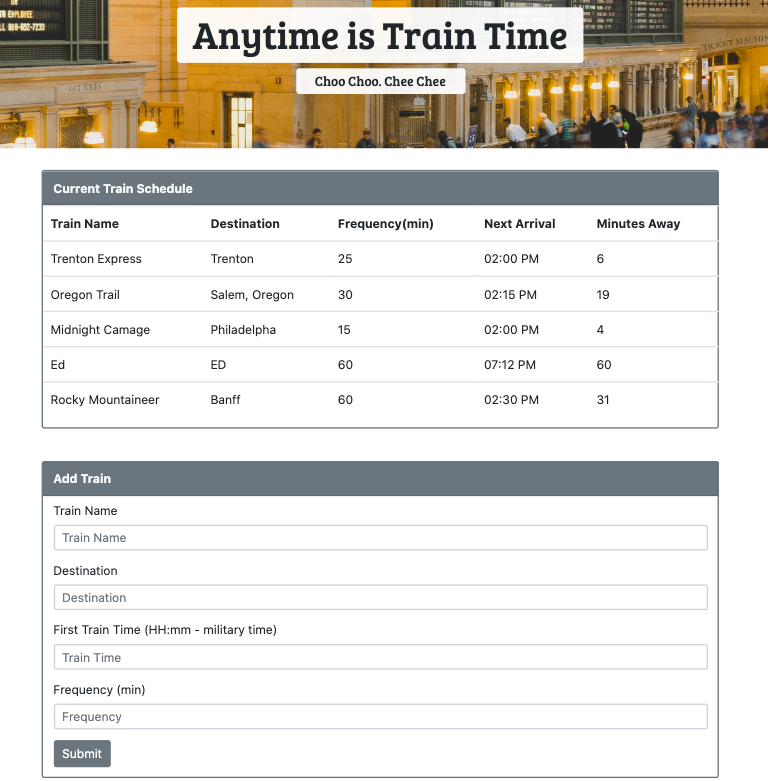

# Train-Time

This is a train schedule application called [Train Time](https://tiurzm.github.io/Train-Time/) that uses Firebase to host arrival and departure data. This application retrieves and manipulates the data with Moment.js and provides up-to-date information about various trains, namely their arrival times and how many minutes remain until they arrive at their station.

## How to use it:
1. Enter the train's name.
2. Enter the train's destination.
3. Enter the time of the train's first arrival .
4. Enter the train's frequency.
5. Click Submit button. 
6. The schedule gives you the next arrival time. 
